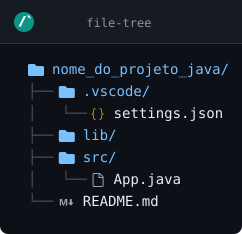

# Lógica de Programação Aplicada a Java

## Sumário

1. [Algoritmo](#algoritmo)
2. [Preparando o VSCode para o Java](#preparando-o-vscode-para-o-java)<br>
    2.1 [Extensões obrigatórias](#extensões-obrigatórias)<br>
    2.2 [Extensões recomendadas](#extensões-recomendadas)<br>
    2.3 [Sugestão de tema para o Java](#sugestão-de-tema-para-o-java)<br>
3. [Novo Projeto Java](#novo-projeto-java)<br>
    3.1 [Executando o projeto](#executando-o-projeto)<br>
    3.2 [Java 25](#java-25)<br>

## Algoritmo

> [!NOTE]
> **Algoritmo** é o nome que se dá a solução de um problema, qualquer um que ele seja. É constituído de uma série de instruções passo-a-passo, que visam alcançar um determinado objetivo. Como exemplos, podemos pegar qualquer tutorial disponível na Internet, como este mesmo. Uma receita de bolo também pode ser considerado um algoritmo.

## Preparando o VSCode para o Java

> [!TIP]
> É interessante que antes de começar a configurar o VSCode para o desenvolvimento, crie um Perfil específico para trabalhar com a linguagem Java:
> 1. Vá no menu **Arquivo -> Preferências -> Perfil -> Perfis**.
> 2. Clique no botão **Novo Perfil**.
> 3. Escolha um nome, mude o ícone, e depois clique em **Criar**.
> 4. Somente após isso que você deve instalar as extensões que desejar.

### Extensões obrigatórias

- Extension Pack for Java (pacote com extensões essenciais)
- Lombok Annotations Support for VS Code
- Code Generator For Java
- Database Client

### Extensões recomendadas

- Comment Anchors
- Error Lens
- VSCode icons

### Sugestão de tema para o Java

- One Dark Pro

## Novo Projeto Java

> [!WARNING]
> Um projeto Java não é igual ao de outras linguagens. Não basta simplesmente criar uma pasta e um arquivo `.java`. O programa Java precisa obrigatoriamente obedecer certos padrões de arquitetura, como veremos a seguir.

Para criar novo projeto Java no VSCode:
1. Abra o Explorador de Arquivos do VSCode (`Ctrl+Shift+E`);
2. Clique com o botão direito do mouse na área vazia do Explorador do VSCode e escolha a opção **New Java Project...**;
3. No alto da janela do VSCode, irá aparecer uma lista de opções. Escolha **No build tools** para o seu primeiro projeto Java;
4. Irá abrir uma janela do Explorador de Arquivos do Windows. Escolha a pasta onde deseja salvar o seu projeto, e clique no botão **Select the project location**;
5. No alto da janela do VSCode, irá aparecer uma caixa de digitação. Informe o nome desejado do seu projeto e aperte `Enter`.
6. Uma nova janela do VSCode irá se abrir já dentro do diretório do seu projeto. Confira abaixo a estrutura de pastas que deve estar aparecendo no Explorador do VSCode:
```
nome_do_projeto_java/
├── .vscode/
│   └── settings.json
├── lib/
├── src/
│   └── App.java
└── README.md

```
[](https://www.readmecodegen.com/file-tree/create-folder-structure-online)

### Executando o projeto

O que importa aqui é a pasta `src/`, mais precisamente o arquivo dentro dela: o `App.java`. Ele é o arquivo principal do seu projeto, e o que deverá ser executado. Ao abrir, você encontrará o seguinte código:
~~~java
public class App {
    public static void main(String[] args) throws Exception {
        System.out.println("Hello, World!");
    }
}
~~~

Para executar o projeto:
- Use a tecla de atalho `Ctrl+F5`;
- Ou aperte o botão **Run** no alto à direita da janela do VSCode;
- Ou acesse o terminal (o VSCode tem um terminal integrado que pode ser acessado com `Ctrl+J`) e siga os passos abaixo:
    1. Entre na pasta `src/` com o comando `cd src`;
    2. Compile o programa pelo comando `javac App.java`;
    3. Execute com `java App`.

O processo para executar com linha de comando pode ser visto abaixo:
~~~
cd src
javac App.java
java App
~~~

### Java 25

> [!NOTE]
> A partir do Java 25, os comandos da linguagem mudaram, embora a forma antiga de se programar ainda tenha sido preservada.<br>
> Neste guia, para cada programa, veremos dois códigos-fonte: um anterior ao java 25 e outro que roda no java 25+.<br>
> Abaixo segue o exemplo de código-fonte do mesmo **Hello World**:
~~~java
void main() {
    IO.println("Hello, World!");
}
~~~