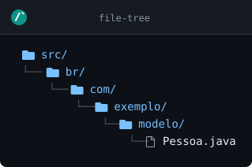
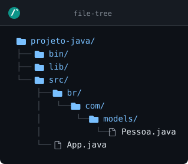
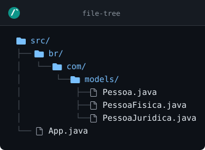

# Orientação a Objetos

[Clique aqui para retornar](https://github.com/dev-alexmachado/guia_rapido_java)

## Sumário

1. [Classes Java](#classes-java)<br>
    1.1 [Objetos](#objetos)<br>
    1.2 [Métodos](#métodos)<br>
2. [Pacotes (packages)](#pacotes-packages)<br>
    2.1 [Declarando um pacote](#declarando-um-pacote)<br>
    2.2 [Pacote e estrutura de pastas](#pacote-e-estrutura-de-pastas)<br>
    2.3 [Importando uma classe](#importando-uma-classe)<br>
    2.4 [Nome completo da classe](#nome-completo-da-classe)<br>
    2.5 [Pacote padrão](#pacote-padrão)<br>
    2.6 [Pacotes e controle de acesso](#pacotes-e-controle-de-acesso)<br>
    2.7 [Criar um novo package no VSCode](#criar-um-novo-package-no-vscode)<br>
    2.8 [Exemplo de estrutura de packages](#exemplo-de-estrutura-de-packages)<br>
3. [Construtor](#construtor)
4. [Herança/Generalização](#herançageneralização)
5. [Polimorfismo](#polimorfismo)
6. [Abstração](#abstração)
7. [Encapsulamento](#encapsulamento)<br>
    7.1 [Modificadores de acesso](#modificadores-de-acesso)<br>
8. [Relação entre Classes](#relação-entre-classes)<br>
    8.1 [Associação](#associação)<br>
    8.2 [Composição](#composição)<br>
    8.3 [Agregação](#agregação)<br>
    8.4 [Depedência](#depedência)<br>


## Classes Java

No paradigma da Orientação a Objetos, o programa é dividido em blocos menores chamados classes, que por sua vez são subdivididos em atributos (valores) e métodos (ações). A partir delas, são criados os objetos.

> [!NOTE]
> Antes do Java 25, cada arquivo `.java` era na verdade uma classe. Isso incluia o arquivo a ser executado, que continha o código-fonte principal. Isso mudou com o Java 25, onde o arquivo principal contém apenas a função `void main()`.<br>
> Já uma classe Java sem ser a principal continua sendo criado da mesma forma que antes: crie um arquivo `.java` e dê o mesmo nome que deseja pôr na classe.

Uma classe Java é feito da seguinte forma, usando como exemplo a classe `Pessoa`:

#### Diagrama de Classes

~~~mermaid
classDiagram
    class Pessoa {
        +String nome
        +int idade
        +double altura
        +cumprimentar() void
    }
~~~

#### Código-fonte da Classe

~~~java
public class Pessoa {
    // atributos
    public String nome;
    public int idade;
    public double altura;

    // método
    public void cumprimentar() {
        IO.print("Olá, meu nome é " + this.nome);
        IO.print(", tenho " + this.idade + " anos");
        IO.print(", e " + this.altura + " metros de altura.");
    }
}
~~~

> [!IMPORTANT]
> Em Java, sempre use a palavra reservada `this` antes dos atributos para chamá-los dentro dos métodos.

### Objetos

Para criar um objeto de uma classe, faça como no exemplo abaixo:
~~~java
void main() {
    // cria objeto da classe
    Pessoa usuario = new Pessoa();

    // entrada de dados
    usuario.nome = IO.readln("Informe o nome: ");
    usuario.idade = Integer.parseInt(IO.readln("Informe a idade: "));
    usuario.altura = Double.parseDouble(IO.readln("Informe a altura em metros: "));

    // saída de dados
    IO.println("Nome: " + nome);
    IO.println("Idade: " + idade + " anos");
    IO.println("Altura: " + altura + " metros");

    // execução do método
    usuario.cumprimentar();
}
~~~

### Métodos

Os métodos representam ações das classes/objetos. Elas podem receber parâmetros/argumentos, e também podem ou não retornarem valores.

>[!WARNING]
> Caso o método retorne algum valor, é necessário informar que tipo de dado ele retorna.

Exemplo:

#### Método sem retorno e sem argumento

Fluxograma:
~~~mermaid
classDiagram
    class Pessoa {
        +cumprimentar() void
    }
~~~

Código-fonte da classe:
~~~java
public class Pesssoa {
    public void cumprimentar() {
        IO.println("Olá, como vai?");
    }
}
~~~

Código-fonte do objeto:
~~~java
void main() {
    Pessoa usuario = new Pessoa();

    // chamando o método
    usuario.cumprimentar();
}
~~~

#### Método sem retorno e com argumento

Fluxograma:
~~~mermaid
classDiagram
    class Pessoa {
        +cumprimentar(String nome) void
    }
~~~

Código-fonte da classe:
~~~java
public class Pesssoa {
    public void cumprimentar(String nome) {
        IO.println("Olá " + nome + ", como vai?");
    }
}
~~~

Código-fonte do objeto:
~~~java
void main() {
    Pessoa usuario = new Pessoa();

    String nome = "Alex";

    // chamando o método
    usuario.cumprimentar(nome);
}
~~~

#### Método com retorno e com argumento

Fluxograma:
~~~mermaid
classDiagram
    class Pessoa {
        +cumprimentar(String nome) String
    }
~~~

Código-fonte da classe:
~~~java
public class Pessoa {
    public String cumprimentar(String nome) {
        return "Olá " + nome + ", como vai?";
    }
}
~~~

Código-fonte do objeto:
~~~java
void main() {
    Pessoa usuario = new Pessoa();

    String nome = "Alex";

    // chamando o método
    IO.println(usuario.cumprimentar(nome));
}
~~~

Ou:
~~~java
void main() {
    Pessoa usuario = new Pessoa();

    String nome = "Alex";

    // chamando o método
    saida = usuario.cumprimentar(nome);
    IO.println(saida);
}
~~~

> [!TIP]
> A criação do objeto de uma classe também é chamado de **instância de classe**.

## Pacotes (packages)

Um **pacote** (*package*) é uma forma de organizar classes e interfaces relacionadas. Ele funciona como uma pasta lógica do projeto e ajuda a:

- evitar conflitos entre classes com o mesmo nome;
- deixar o projeto mais organizado;
- controlar o acesso entre classes por meio dos modificadores de acesso.

### Declarando um pacote

A declaração do pacote deve ser a primeira instrução do arquivo `.java`, antes das classes e dos `import`s:

~~~java
package modelo;

public class Pessoa {
    public String nome;
}
~~~

Por convenção, os nomes dos pacotes são escritos em letras minúsculas. Em projetos maiores, é comum usar o domínio invertido da organização, por exemplo `br.com.exemplo.modelo`.

### Pacote e estrutura de pastas

O caminho das pastas deve acompanhar o nome do pacote. Assim, uma classe declarada como `package br.com.exemplo.modelo;` normalmente fica em:

~~~text
src/
└── br/
    └── com/
        └── exemplo/
            └── modelo/
                └── Pessoa.java
~~~
[](https://www.readmecodegen.com/file-tree/create-folder-structure-online)

Essa correspondência permite que o compilador e as ferramentas do projeto encontrem a classe corretamente.

### Importando uma classe

Para usar uma classe que está em outro pacote, utilize `import`:

#### No Java anterior ao 25
~~~java
package aplicacao;

import br.com.exemplo.modelo.Pessoa;

public class Programa {
    public static void main(String[] args) {
        Pessoa pessoa = new Pessoa();
    }
}
~~~

#### No Java 25+
~~~java
import br.com.exemplo.modelo.Pessoa;

void main() {
    Pessoa pessoa = new Pessoa();
}
~~~

Também é possível importar todas as classes diretamente de um pacote com `*`:

~~~java
import br.com.exemplo.modelo.*;
~~~

Porém, o `*` não inclui classes de subpacotes. Por exemplo, importar `br.com.exemplo.modelo.*` não importa classes de `br.com.exemplo.modelo.dados`.

### Nome completo da classe

O `import` é apenas uma conveniência. Sem ele, a classe pode ser usada pelo nome completo, formado pelo pacote e pelo nome da classe:

~~~java
br.com.exemplo.modelo.Pessoa pessoa = new br.com.exemplo.modelo.Pessoa();
~~~

Essa forma é útil quando existem classes com o mesmo nome em pacotes diferentes.

### Pacote padrão

Se um arquivo não tiver uma declaração `package`, ele estará no **pacote padrão**. Esse recurso pode funcionar em exemplos pequenos, mas deve ser evitado em projetos reais: classes dentro de pacotes nomeados não conseguem importar classes do pacote padrão.

### Pacotes e controle de acesso

Quando nenhum modificador de acesso é informado, o membro ou a classe tem acesso de **pacote** (*package-private*): pode ser acessado por classes do mesmo pacote, mas não por classes de outros pacotes.

~~~java
package modelo;

public class CadastroInterno {
    public String codigo;
}
~~~

Nesse exemplo, `CadastroInterno` só pode ser usado por classes do pacote `modelo`. Para permitir o uso em outros pacotes, a classe ou membro precisa de um modificador como `public`.

### Criar um novo package no VSCode

> [!TIP]
> Crie primeiro um novo *package*, e só depois crie uma nova classe Java.

1. Clique com o botão direito do mouse em cima da pasta `src/`;
2. Clique em **New Java Package...**;
3. Informe o nome desejado para o *package*, seguindo o padrão de mercado, e dê `Enter`. Exemplo: `br.com.nome.models`;

#### Para criar um package dentro de outro package

1. Clique com o botão direito do mouse em cima do diretório do package;
2. Dê o nome do do seu package após o ponto depois do último nome do package e dê `Enter`.

#### Para criar uma nova classe dentro do package

1. Clique com o botão direito do mouse em cima do package desejado;
2. Clique na opção **New Java File -> Class...**;
3. Dê o nome da sua classe, começando com letra maiúscula.

### Exemplo de estrutura de packages

#### Diretórios

```
projeto-java/
├── bin/
├── lib/
└── src/
    ├── br/
    │   └── com/
    │       └── models/
    │           └── Pessoa.java
    └── App.java

```
[](https://www.readmecodegen.com/file-tree/create-folder-structure-online)

> [!WARNING]
> Dentro da pasta `bin`, tem conteúdo necessário para o funcionamento do seu programa, mas não mexemos nela. A única coisa que importa para o desenvolvedor é o conteúdo da pasta `src/`.

Exemplo do código-fonte da estrutura acima:

#### Classe Pessoa

~~~java
// declara o package
package br.com.models;

public class Pessoa {
    public String nome;
    public int idade;

    public void exibirDados() {
        IO.println("Nome: " + this.nome);
        IO.println("Idade: " + this.idade);
    }
}
~~~

#### App.java
~~~java
// importa a classe Pessoa
import br.com.models.Pessoa;

void main () {
    Pessoa usuario = new Pessoa();

    usuario.nome = IO.readln("Informe o nome: ");
    usuario.idade = IO.readln("Informe a idade: ");

    usuario.exibirNome();
}
~~~

## Construtor

Um construtor é um método obrigatório responsável pela instância da classe no algoritmo principal, ou seja, é ele quem cria os objetos do programa. Para criar um construtor, ele deve ser obrigatoriamente público, e deve ter o nome da classe.

Exemplo:

#### Construtor padrão (vazio)

~~~java
package br.com.models;

public class Pessoa {
    public String nome;
    public int idade;

    // construtor
    public Pessoa() {
        // construtor vazio
    }
}
~~~

#### Construtor que inicializa os atributos

~~~java
package br.com.models;

public class Pessoa {
    public String nome;
    public int idade;

    // construtor
    public Pessoa(String nome, int idade) {
        this.nome = nome;
        this.idade = idade;
    }
}
~~~

> [!WARNING]
> Caso use o construtor para inicializar os atributos, é necessário atribuir valores aos atributos durante a instância.

#### Instanciando uma classe com construtor cheio

~~~java
import br.com.models;

void main() {
    Pessoa usuario = new Pessoa("Alex", 41);

    IO.println("Nome: " + usuario.nome);
    IO.println("Idade: " + usuario.idade);
}
~~~

> [!TIP]
> Em Java, é possível ter mais de um construtor em uma classe.

#### Classse com mais de um construtor

~~~java
package br.com.models;

public class Pessoa {
    public String nome;
    public int idade;

    public Pessoa() {
        // construtor vazio
    }

    public Pessoa(String nome, int idade) {
        this.nome = nome;
        this.idade = idade;
    }
}
~~~

#### Instanciando a classe com mais de um construtor

~~~java
import br.com.models;

void main() {
    Pessoa usuario1 = new Pessoa();
    Pessoa usuario2 = new Pessoa("Alex", 41);

    // restante do código...
}
~~~

## Herança/Generalização

Para evitar redundâncias no código-fonte, cria-se uma única classe (que chamamos de **superclasse** ou **classe-pai**) para reunir atributos e métodos comuns a mais de uma classe. Isso é chamado de **herança** ou **Generalização**.

Exemplo:

#### Estrutura de diretórios
```
src/
├── br/
│   └── com/
│       └── models/
│           ├── Pessoa.java
│           ├── PessoaFisica.java
│           └── PessoaJuridica.java
└── App.java

```
[](https://www.readmecodegen.com/file-tree/create-folder-structure-online)

#### Diagrama de Classes
~~~mermaid
classDiagram
    class Pessoa {
        +String email;
        +String telefone;
        +Pessoa() void
        +cumprimentar(String nome) String
    }

    class PessoaFisica {
        +String nome;
        +String cpf;
    }

    class PessoaJuridica {
        +String razaoSocial;
        +String nomeFantasia;
        +String cnpj;
    }

    Pessoa <|-- PessoaFisica
    Pessoa <|-- PessoaJuridica
~~~

#### Pessoa.java
~~~java
package br.com.models;

public class Pessoa {
    public String email;
    public String telefone;

    public Pessoa() {}

    public String cumprimentar(String nome) {
        return "Olá " + nome + ", prazer em conhecer!";
    }
}
~~~

#### PessoaFisica.java
~~~java
package br.com.models;

// classe que herda de Pessoa
public class PessoaFisica extends Pessoa {
    public String nome;
    public String cpf;
}
~~~

#### PessoaJuridica.java
~~~java
package br.com.models;

// classe que herda de Pessoa
public class PessoaJuridica extends Pessoa {
    public String nomeFantasia;
    public String razaoSoccial;
    public String cnpj;
}
~~~

#### App.java
~~~java
import br.com.models.PessoaFisica;
import br.com.models.PessoaJuridica;

void main() {
    PessoaFisica usuario = new PessoaFisica();
    PessoaJuridica empresa = new PessoaJuridica();

    usuario.nome = IO.readln("Informe o nome do usuário: ");
    usuario.cpf = IO.readln("Informe o CPF do usuário: ");
    usuario.email = IO.readln("Informe o e-mail do usuário: ");
    usuario.telefone = IO.readln("Informe o telefone do usuário: ");

    empresa.razaoSocial = IO.readln("Informe a razão social da empresa: ");
    empresa.nomeFantasia = IO.readln("Informe o nome da empresa: ");
    empresa.cnpj = IO.readln("Informe o CNPJ da empresa: ");
    empresa.email = IO.readln("Informe o e-mail da empresa: ");
    empresa.telefone = IO.readln("Informe o telefone da empresa: ");

    IO.println("Nome do usuário: " + usuario.nome);
    IO.println("CPF do usuário: " + usuario.cpf);
    IO.println("E-mail do usuário: " + usuario.email);
    IO.println("Telefone do usuário: " + usuario.telefone);

    IO.println("Razão Social da empresa: " + usuario.empresa);
    IO.println("Nome da empresa: " + usuario.nomeFantasia);
    IO.println("CNPJ da empresa: " + usuario.cnpj);
    IO.println("E-mail da empresa: " + usuario.email);
    IO.println("Telefone da empresa: " + usuario.telefone);

    usuario.cumprimentar(empresa.nomeFantasia);
    empresa.cumprimentar(usuario.nome);
}
~~~

> [!NOTE]
> Em orientação a objetos, há o que chamamos de **Os 4 pilares da Orientação a Objetos**. São eles:
> - Herança ou generalização;
> - Polimorfismo;
> - Abstração;
> - Encapsulamento.

## Polimorfismo

Em Orientação a Objetos, um Polimorfismo acontece quando um método existe em duas classes diferentes, mas se comportam de maneiras totalmente diferentes.

Vamos pegar o exemplo mostrado acima em Herança e adicionar um método na superclasse chamado `exibirDados()`:

#### Diagrama de Classes
~~~mermaid
classDiagram
    class Pessoa {
        +String email;
        +String telefone;
        +Pessoa() void
        +cumprimentar(String nome) String
        +exibirDados() void
    }

    class PessoaFisica {
        +String nome;
        +String cpf;
    }

    class PessoaJuridica {
        +String razaoSocial;
        +String nomeFantasia;
        +String cnpj;
    }

    Pessoa <|-- PessoaFisica
    Pessoa <|-- PessoaJuridica
~~~

#### Código-fonte classe Pessoa.java
~~~java
package br.com.models;

public class Pessoa {
    public String email;
    public String telefone;

    public Pessoa() {}

    public cumprimentar(String nome) {
        return "Olá " + nome + ", prazer em conhecer!";
    }

    public void exibirDados() {
        IO.println("Nome: " + this.nome);
        IO.println("E-mail: " + this.email);
    }
}
~~~

Nesse caso, as subclasses `PessoaFisica` e `PessoaJuridica` já estão herdando o novo método. Mas eu preciso que `exibirDados()` mostre os atributos exclusivos de cada classe, e para isso, é necessário alterar o comportamento do método, o que define justamente o **polimorfismo**.

#### Código-fonte classe PessoaFisica.java
~~~java
package br.com.models;

// classe que herda de Pessoa
public class PessoaFisica extends Pessoa {
    public String nome;
    public String cpf;

    public void exibirDados() {
        IO.println("Nome: " + this.nome);
        IO.println("CPF: " + this.cpf);
        super.exibirDados();
    }
}
~~~

#### Código-fonte classe PessoaJuridica.java
~~~java
package br.com.models;

// classe que herda de Pessoa
public class PessoaJuridica extends Pessoa {
    public String nomeFantasia;
    public String razaoSoccial;
    public String cnpj;

    public void exibirDados() {
        IO.println("Nome da empresa: " + this.nomeFantasia);
        IO.println("Razão Social da empresa: " + this.razaoSocial);
        IO.println("CNPJ: " + this.cnpj);
        super.exibirDados();
    }
}
~~~

Agora que alteramos o comportamento do método `exibirDados()`, ele irá fazer execuções diferentes em cada objeto no arquivo principal:

#### App.java
~~~java
import br.com.models.PessoaFisica;
import br.com.models.PessoaJuridica;

void main() {
    PessoaFisica usuario = PessoaFisica();
    PessoaJuridica empresa = PessoaJuridica();

    usuario.nome = IO.readln("Informe o nome do usuário: ");
    usuario.cpf = IO.readln("Informe o CPF do usuário: ");
    usuario.email = IO.readln("Informe o e-amil do usuário: ");
    usuario.telefone = IO.readln("Informe o telefone do usuário: ");

    empresa.razaoSocial = IO.readln("Informe a razão social da empresa: ");
    empresa.nomeFantasia = IO.readln("Informe o nome da empresa: ");
    empresa.cnpj = IO.readln("Informe o cnpj da empresa: ");
    empresa.email = IO.readln("Informe o e-mail da empresa: ");
    empresa.telefone = IO.readln("Informe o telefone da empresa: ");

    usuario.exibirDados();
    empresa.exibirDados();
}
~~~

## Abstração

O conceito de abstração se refere a uma classe que não pode ser instanciada. Se, por exemplo, não desejamos que uma classe seja instanciada, pois está fazendo o papel de uma superclasse para outras subclasses, podemos tornar a superclasse uma classe abstrata. Isso fará com que a regra de negócio seja respeitada, e a integridade do sistema não seja ferida.

Veja no exemplo abaixo:

#### Diagrama de Classes
~~~mermaid
classDiagram
    class Pessoa {
        <<abstract>>
        +String email;
        +String telefone;
        +Pessoa() void
        +exibirDados() void
    }

    class PessoaFisica {
        +String nome;
        +String cpf;
    }

    class PessoaJuridica {
        +String razaoSocial;
        +String nomeFantasia;
        +String cnpj;
    }

    Pessoa <|-- PessoaFisica
    Pessoa <|-- PessoaJuridica
~~~

#### Código-fonte Pessoa.java
~~~java
package br.com.models;

public abstract class Pessoa {
    public String email;
    public String telefone;

    public Pessoa() {}

    public void exibirDados() {
        IO.println("Nome: " + this.nome);
        IO.println("E-mail: " + this.email);
    }
}
~~~

> [!TIP]
> para este exemplo, a única mudança está na classe abstrata, e portanto não será mostrado o código-fonte de `PessoaFisica`, `PessoaJuridica` e `App.java`, já que são os mesmos do exemplo anterior.

## Encapsulamento

Encapsulamento trata-se de esconder elementos que você não deseja que outros códigos fora da classe não vejam. Geralmente estamos falando de atributos da classe que não devem ser acessados de forma direta, então proibimos o acesso por qualquer outra classe que não seja ela mesma, e o acesso passa a ser feito através dos métodos de acesso `get` e `set`.

### Modificadores de acesso

Os modificadores de acesso são o que define quem e como vão ser feitos os acessos. Os modificadores de acesso reconhecidos pelo Java são:
- `+` | `public`: visível e acessível para todos
- `#` | `protected`: vísivel e acessível para a classe e suas subclasses
- `~` | `package-private`: visível e acessível para qualquer classe dentro do seu próprio `package`
- `-` | `private`: visivel e acessível apenas para a própria classe, e invisível e incessível para todo o restante do programa

#### Diagrama de Classes

~~~mermaid
classDiagram
    class Pessoa {
        -String nome;
        -int idade;
        -double altura;
        +getNome() String
        +setNome(String nome) void
        +getIdade() int
        +setIdade(int idade) void
        +getAltura() double
        +setAltura(double altura) void
    }
~~~

#### Código-fonte Pessoa.java
~~~java
package br.com.models;

public class Pessoa {
    private String nome;
    private int idade;
    private double altura;

    public String getNome() {
        return this.nome;
    }

    public void setNome(String nome) {
        this.nome = nome;
    }
    
    public int getidade() {
        return this.idade;
    }

    public void setidade(int idade) {
        this.idade = idade;
    }
    public double getaltura() {
        return this.altura;
    }

    public void setaltura(double altura) {
        this.altura = altura;
    }

}
~~~

#### Código-fonte App.java
~~~java
import br.com.models.Pessoa;

void main() {
    Pessoa usuario = new Pessoa();

    // entrada de dados
    usuario.setNome(IO.readln("Informe o nome: "));
    usuario.setIdade(Integer.parseInt(IO.readln("Informe a idade: ")));
    usuario.setAltura(Double.parseDouble(IO.readln("Informe a altura: ")));

    // saída de dados
    IO.println("Nome: " + usuario.getNome());
    IO.println("Idade: " + usuario.getIdade() + " anos");
    IO.println("Altura: " + usuario.getAltura() + " metros");
}
~~~

## Relação entre Classes

### Associação

> [!NOTE]
> Na associação, as classes possuem relação entre si, mas podem existir de forma independente uma da outra.

Exemplo de associação entre uma classe `Endereco` e `Pessoa`:

#### Diagrama de Classes
~~~mermaid
classDiagram
    class Endereco {
        -String rua
        -String cidade
        +obterEndereco() String
    }
    class Pessoa {
        -String nome
        -Endereco endereco
        +apresentar() void
        +trocarEndereco(Endereco novoEndereco) void
    }

    Pessoa --> Endereco : possui
~~~

#### Código-fonte Endereco.java

~~~java
package br.com.models;

public class Endereco {
    private String rua;
    private String cidade;

    public Endereco() {}

    public String getRua() {
        return this.rua;
    }

    public void setRua(String rua) {
        this.rua = rua;
    }

    public String getCidade() {
        return this.cidade = cidade;
    }

    public void setCidade(String cidade) {
        this.cidade = cidade;
    }

    public String obterEndereco() {
        return this.endereco + ", " + this.cidade;
    }
}
~~~

#### Código-fonte Pessoa.java
~~~java
package br.com.models;

public class Pessoa {
    private String nome;
    private Endereco endereco;

    public Pessoa() {}

    public String getNome() {
        return this.nome;
    }

    public void setNome(String nome) {
        this.nome = nome;
    }

    public Endereco getEndereco() {
        return this.endereco;
    }

    public void setEndereco(Endereco endereco) {
        this.endereco = endereco;
    }

    public void apresentar() {
        IO.println("Nome: " + this.nome);
        IO.println("Endereço: " + this.endereco.obterEndereco());
    }

    public void trocarEndereco(Endereco novoEndereco) {
        this.endereco = novoEndereco;
    }
}
~~~

### Composição

> [!NOTE]
> Na composição, obrigatoriamente um dos atributos de uma classe é um objeto de outra classe. Nesse caso, há uma dependência de uma das classes em relação à outra.
> Uma classe possui outra classe como parte essencial dela. Se o objeto principal for destruído, o objeto da outra classe também perde sentido.

Exemplo de composição entre as classes `Motor` e `Carro`:

#### Fluxograma
~~~mermaid
classDiagram
    class Motor {
        -int potencia
        +info() String
    }

    class Carro {
        -String modelo
        -Motor motor
        +detalhes() String
    }

    Carro "1" *-- "1" Motor : composto por
~~~

## Agregação

> [!NOTE]
> Na agregação, uma classe possui outra classe, mas essa outra classe pode existir independentemente.

Exemplo de agregação entre as classes `Departamento` e `Empresa`:

#### Fluxograma
~~~mermaid
classDiagram
    class Departamento {
        -String nome
        +get_nome() String
    }

    class Empresa {
        -String nome
        -Departamento departamento
        +detalhes() String
    }

    Empresa "1" o-- "1" Departamento : possui

~~~

### Depedência

> [!NOTE]
> Na dependência, uma classe utiliza outra classe temporariamente, mas não a mantém como atributo principal.

Exemplo de dependência entre as classes `Calculadora` e `Pedido`:

#### Fluxograma
~~~mermaid
classDiagram
    class Calculadora {
        +somar(int a, int b) int
    }

    class Pedido {
        -int valor1
        -int valor2
        +calcular_total() int
    }

    Pedido ..> Calculadora : usa
    
~~~